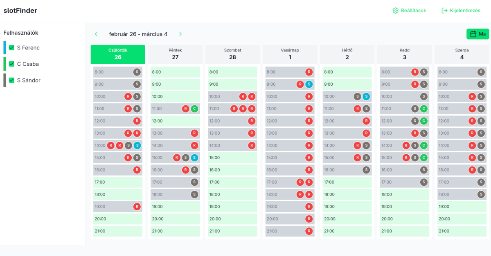
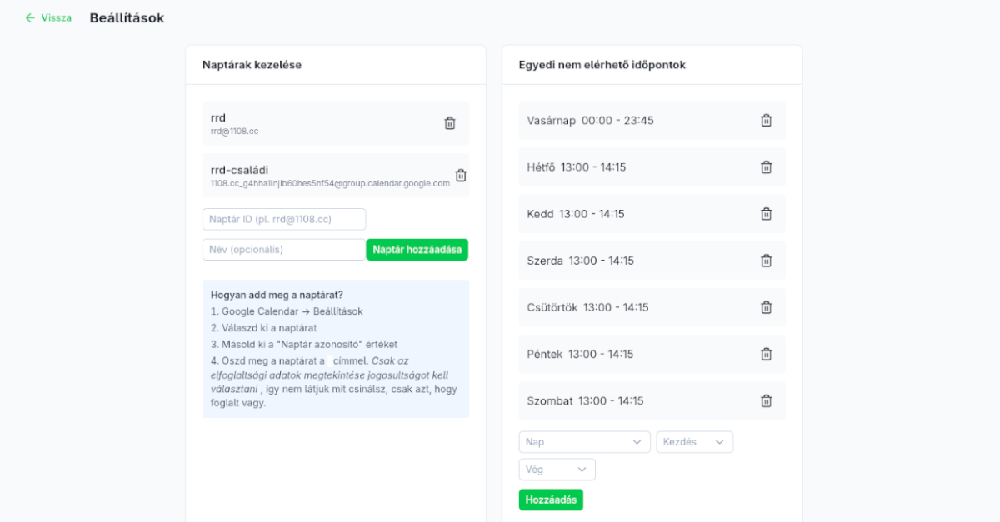

# slotFinder

Magyar nyelvű alkalmazás csapatok közös időpont egyeztetésére Google Calendar használatával.

## Funkciók

- 🔐 Felhasználókezelés (bejelentkezés, regisztráció, Google fiókkal)
- 📅 Google Calendar integráció (service account-on keresztül)
- 👥 Más felhasználók foglalt időpontjainak megtekintése
- ⭐ Szabad idősávok kiemelése
- 📤 Meghívó küldése szabad időpontra
- ⚙️ Egyedi nem elérhető időpontok beállítása (pl. vasárnap, ebédidő)
- 💾 5 perces cache a gyorsabb működéshez

## Képernyőképek




## Telepítés

### 1. Klónozás

```bash
git clone https://github.com/rrd108/slotFinder.git
cd slotFinder
```

### 2. Dependencies telepítése

```bash
npm install
```

### 3. Google Service Account beállítása

1. Hozd létre a [Google Cloud Console](https://console.cloud.google.com/)-on
2. API-k és szolgáltatások → Könyvtár → Google Calendar API → Engedélyezés
3. Hitelesítő adatok → Szolgáltatásfiók létrehozása
4. Kulcs létrehozása → JSON formátum
5. Mentsd el a fájlt a projekt gyokerében (bármilyen névvel)
6. Állítsd be a `nuxt.config.ts` fájlban a `googleCalendarServiceKey` és `googleCalendarServiceEmail` értékeket

### 4. Adatbázis létrehozása

```bash
mkdir -p data
npx nuxt-users migrate
sqlite3 data/users.db < misc/database.sql
```

### 5. Admin felhasználó létrehozása

```bash
npx nuxt-users create-user -e "admin@ példa.hu" -n "Admin" -p "Jelszó123!" -r admin
```

### 6. Futtatás

```bash
npm run dev
```

Az alkalmazás a `http://localhost:3000` címen érhető el.

## Google Calendar megosztás

Minden felhasználónak meg kell osztania a naptárát a service account-tal:

1. Google Calendar → Beállítások → Naptár kiválasztása
2. Naptár megosztása specific személyekkel
3. Add hozzá a service account email címét (a `nuxt.config.ts`-ban beállított értéket)
4. jogosultság: **Csak az elfoglaltsági adatok megtekintése**

## Használat

1. **Bejelentkezés** az email/jelszó párossal
2. **Beállítások** oldalon add hozzá a Google Calendar ID-d
3. **Főoldalon** válaszd ki a más felhasználókat
4. A naptár mutatja a szabad és foglalt időpontokat
5. Szabad idősávra kattintva meghívót küldhetsz

## Deployment

```bash
npm run build
node .output/server/index.mjs
```

Vagy PM2-vel:

```bash
pm2 start .output/server/index.mjs --name slotfinder
```

## Technológia

- **Framework**: Nuxt 4
- **UI**: @nuxt/ui v4
- **Auth**: nuxt-users
- **Adatbázis**: SQLite
- **Google API**: googleapis

## Önhosztolás

Ez az alkalmazás bármilyen szerveren futtatható, amely támogatja a Node.js alkalmazásokat.

### VPS (DigitalOcean, Hetzner, Linode, stb.)

```bash
# Szerver beállítása
sudo apt update && sudo apt install -y nodejs npm git

# Klónozás
git clone https://github.com/rrd108/slotFinder.git
cd slotFinder

# Telepítés
npm install
npm run build

# Futtatás PM2-vel
pm2 start .output/server/index.mjs --name slotfinder
pm2 startup  # követd az utasításokat a rendszerindításhoz
pm2 save
```

### Docker

```bash
# Dockerfile létrehozása
cat > Dockerfile << 'EOF'
FROM node:20-alpine

WORKDIR /app
COPY package*.json ./
RUN npm install
COPY . .
RUN npm run build

EXPOSE 3000
CMD ["node", ".output/server/index.mjs"]
EOF

# Build és futtatás
docker build -t slotfinder .
docker run -d -p 3000:3000 --name slotfinder slotfinder
```

### Render / Railway / Fly.io

1. Csatlakoztasd a GitHub repository-t
2. Build command: `npm run build`
3. Start command: `node .output/server/index.mjs`
4. Add environment változókat (NUXT_ prefix nélkül a .env-ből)

### Fontos az önhosztoláshoz

- Az `app.config.ts` vagy környezeti változókban állítsd be a `NUXT_PUBLIC_BASE_URL` címet
- A `data` mappa az SQLite adatbázist tartalmazza - backup-oláshoz másold le
- A `nuxt.config.ts`-ban állítsd be a Google Calendar service account beállításokat

## Licenc

MIT
